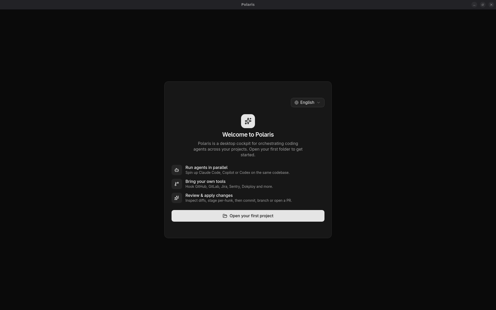
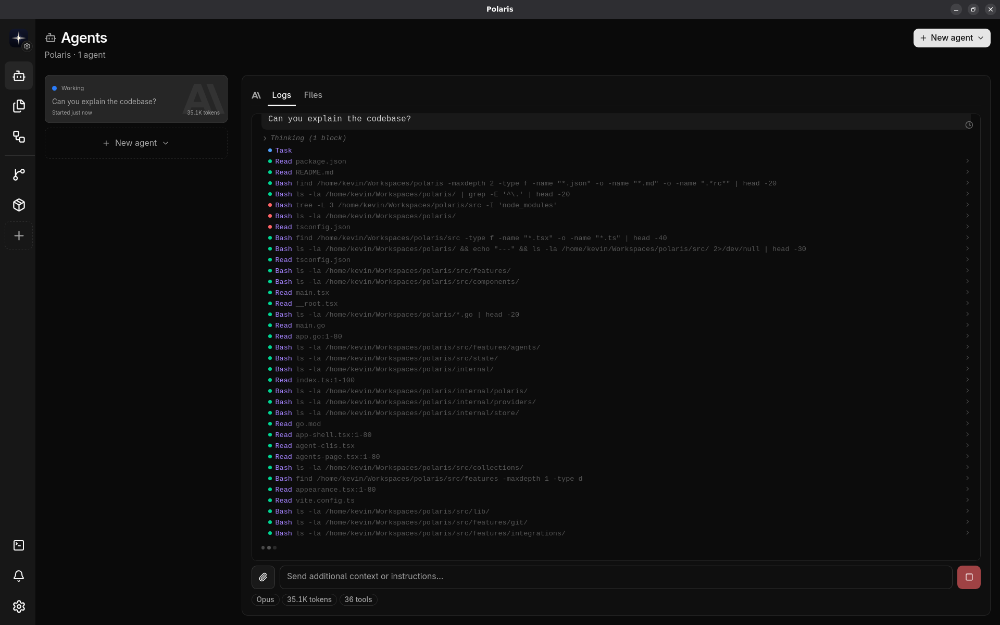
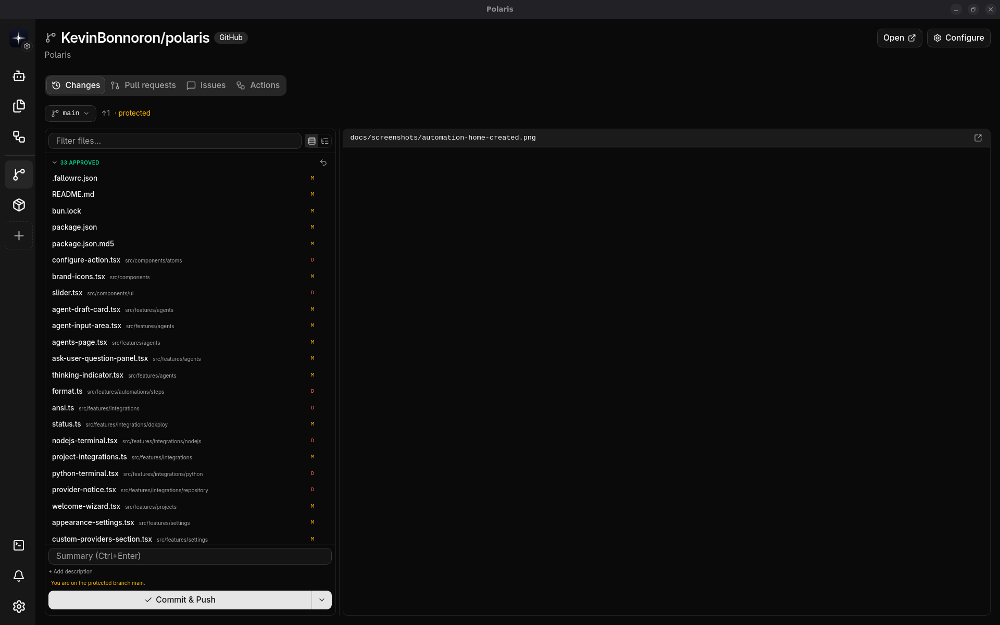
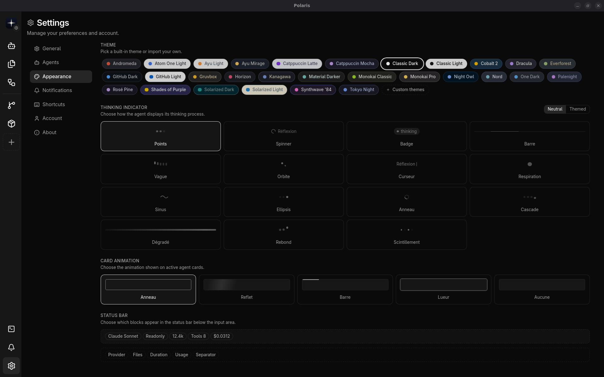

# Polaris

> Desktop cockpit to orchestrate multiple AI coding agents (Claude Code, GitHub Copilot, Cursor, Codex, Gemini, Mistral) across all your projects.

[](https://wails.io/)
[](https://go.dev/)
[](https://react.dev/)
[](https://www.typescriptlang.org/)
[](https://bun.com/)
[](https://vitejs.dev/)
[](https://tailwindcss.com/)
[](https://tanstack.com/router)
[](LICENSE)



## Overview

Polaris is a desktop application (Wails + Go + React) that centralizes the management of your AI coding agents. Launch, monitor, and coordinate multiple agent CLIs in parallel, in isolated Git worktrees, with full visibility into their logs, token usage, and outputs.

## Features

### Multi-agent orchestration

Run multiple agents side by side across all your projects, each in its own isolated Git worktree.

| Agent | Models |
|---|---|
| **Claude Code** | Opus, Sonnet, Haiku (with extended thinking) |
| **GitHub Copilot** | Claude, GPT-5, Gemini, o3, and more |
| **Cursor** | 25+ models including thinking variants |
| **OpenAI Codex** | GPT-5, o3, o4-mini |
| **Google Gemini** | 2.5 Flash/Pro, Gemini 3 |
| **Mistral** | Medium 3.5, Devstral Small |
| **Custom providers** | Any provider via opencode ACP (stdio JSON-RPC) |

Agent CLIs are auto-detected from your PATH. Per-agent model defaults are persisted per project.



### Git & version control

- Stage/unstage files, commit with AI-generated messages, push, sync
- Branch management (list, switch, create, delete)
- Diff viewer (worktree vs HEAD)
- One-click PR creation from an agent's work
- Each agent runs in its own Git worktree — zero interference with your main branch

### Integrations

| Integration | Capabilities |
|---|---|
| **GitHub / GitLab / Bitbucket** | PRs, issues, workflow runs, branches. Token auto-detected from system credentials |
| **Jira** | Active sprint, issue creation, transitions, assignees, story points |
| **Node.js** | npm/Yarn/pnpm/Bun/Deno — detect scripts, run them, manage dependencies |
| **Python** | Poetry/PDM/uv/Pipenv/pip — scripts, dependencies, virtual envs |
| **Docker** | Dockerfile/Compose parsing, linting, vulnerability scanning |
| **Sentry** | Issue list, event details, status management |
| **Dokploy** | Service status, deployment history, logs, restart/start/stop |
| **Slack / Discord / Telegram** | Webhook-based notifications |
| **Resend** | Email sending, domain management |



### Automations

Schedule recurring agent tasks with full history, manual triggers, and conditional execution based on integration events (GitHub, Jira sprints, etc.).

### Appearance & customization



**Themes** — Built-in light/dark themes plus a custom theme importer: paste or upload a JSON token file to define your own color scheme.

**Thinking indicator** — 15 animated styles to visualize agent reasoning: Dots, Spinner, Badge, Bar, Wave, Orbit, Cursor, Breathing, Sine wave, Ellipsis, Ring, Cascade, Gradient, Bounce, Flicker. Each can run in neutral or accent color mode.

**Card animation** — 5 styles for agent cards while running: Pulse, Shimmer, Progress bar, Glow, or None.

**Configurable status bar** — Drag-and-drop the blocks shown in the agent status bar. Available blocks: Model, Tools, Tokens, Tools used, Cost, Provider, Files, Duration, Usage (remaining or used). Add separators (·, |, —) between blocks. Order and visibility are persisted.

### IDE & terminal

Auto-detects VS Code, Cursor, Zed, Windsurf, JetBrains IDEs, Sublime Text, Xcode, and Vim. Open any project or file directly from Polaris, with line/column navigation support. Custom IDE command templates supported.

### Notifications

Native notification center with read/unread state. Focus-aware: notifications can pause while the app window is active.

## Stack

- **Backend**: Go + Wails v2, SQLite, agent runner with log capture
- **Frontend**: React 19, TypeScript, TanStack Router/DB/Form, Radix UI + Tailwind CSS 4, i18next (EN/FR)
- **Tooling**: Bun, Vite, Biome

## Getting started

Requirements: [Bun](https://bun.com/), [Go](https://go.dev/) 1.22+, [Wails CLI](https://wails.io/docs/gettingstarted/installation).

```bash
bun install
bun run dev
```

To build the application:

```bash
bun run build
```

### Build with Nix

If you have [Nix](https://nixos.org/download) with flakes enabled, you can build the app straight from the repo with no other tooling installed:

```bash
nix build github:KevinBonnoron/polaris   # remote
nix build                                # from a local clone
./result/bin/polaris
```

Or run it directly:

```bash
nix run github:KevinBonnoron/polaris
```

## Scripts

| Command | Description |
|---|---|
| `bun run dev` | Run Wails in dev mode (hot reload) |
| `bun run dev:web` | Run the Vite frontend only |
| `bun run build` | Production build of the desktop app |
| `bun run typecheck` | TypeScript type-check |
| `bun run format` | Format code with Biome |
| `bun run generate:bindings` | Regenerate Wails Go↔TS bindings |

## License

MIT
